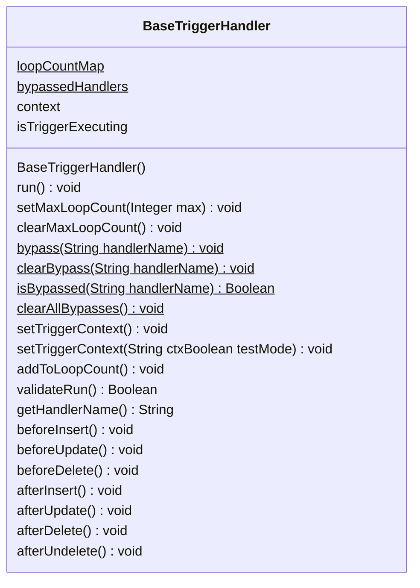

## Introducción

<!-- START autogenerated-class -->
## Descripción

- Status: Active
- Api Version: 59
- Interface 

## Diagrama

### Metodos
*Constructores*
| #   | Argumentos |
| --- | ---------- |
| 

 | <ul></ul>|

*Metodos*
| #   | Nombre | Return | Argumentos |
| --- | ------ | ------ | ---------- |
| 

 | run | void| <ul></ul>|
| 

 | setMaxLoopCount | void| <ul><li>Integer max</li></ul>|
| 

 | clearMaxLoopCount | void| <ul></ul>|
| 
$
 | bypass | void| <ul><li>String handlerName</li></ul>|
| 
$
 | clearBypass | void| <ul><li>String handlerName</li></ul>|
| 
$
 | isBypassed | Boolean| <ul><li>String handlerName</li></ul>|
| 
$
 | clearAllBypasses | void| <ul></ul>|
| 

 | setTriggerContext | void| <ul></ul>|
| 

 | setTriggerContext | void| <ul><li>String ctx</li><li>Boolean testMode</li></ul>|
| 

 | addToLoopCount | void| <ul></ul>|
| 

 | validateRun | Boolean| <ul></ul>|
| 

 | getHandlerName | String| <ul></ul>|
| 

 | beforeInsert | void| <ul></ul>|
| 

 | beforeUpdate | void| <ul></ul>|
| 

 | beforeDelete | void| <ul></ul>|
| 

 | afterInsert | void| <ul></ul>|
| 

 | afterUpdate | void| <ul></ul>|
| 

 | afterDelete | void| <ul></ul>|
| 

 | afterUndelete | void| <ul></ul>|

| #  | Referencia       | #  | Referencia |
| -- | ---------------- | -- | ---------- |
| +  | public or global | #  | protected  |
| -  | private          | ~  | Package    |
| $  | final or static  | *  | abstract   |

<!-- END autogenerated-class -->
