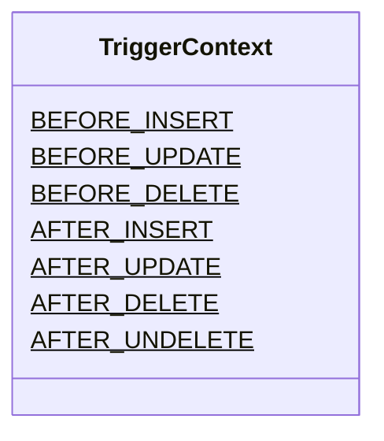

## Introducción

<!-- START autogenerated-class -->
## Diagrama

### Metodos

*Metodos*
| #   | Nombre | Return | Argumentos |
| --- | ------ | ------ | ---------- |

| #  | Referencia       | #  | Referencia |
| -- | ---------------- | -- | ---------- |
| +  | public or global | #  | protected  |
| -  | private          | ~  | Package    |
| $  | final or static  | *  | abstract   |

<!-- END autogenerated-class -->
