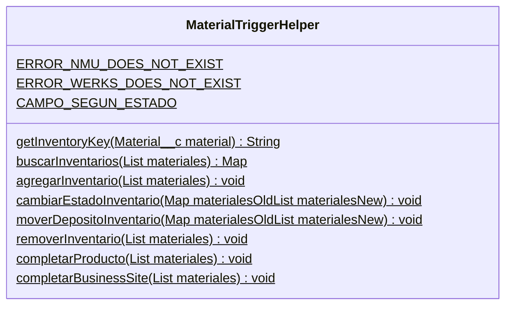

## Introducción

<!-- START autogenerated-class -->
## Descripción

- Status: Active
- Api Version: 59
- Creada: 27 de junio de 24
- Modificada: 27 de junio de 24
- Interface 

## Diagrama

### Metodos

*Metodos*
| #   | Nombre | Return | Argumentos |
| --- | ------ | ------ | ---------- |
| 
$
 | getInventoryKey | String| <ul><li>Material__c material</li></ul>|
| 
$
 | buscarInventarios | Map| <ul><li>List materiales</li></ul>|
| 
$
 | agregarInventario | void| <ul><li>List materiales</li></ul>|
| 
$
 | cambiarEstadoInventario | void| <ul><li>Map materialesOld</li><li>List materialesNew</li></ul>|
| 
$
 | moverDepositoInventario | void| <ul><li>Map materialesOld</li><li>List materialesNew</li></ul>|
| 
$
 | removerInventario | void| <ul><li>List materiales</li></ul>|
| 
$
 | completarProducto | void| <ul><li>List materiales</li></ul>|
| 
$
 | completarBusinessSite | void| <ul><li>List materiales</li></ul>|

| #  | Referencia       | #  | Referencia |
| -- | ---------------- | -- | ---------- |
| +  | public or global | #  | protected  |
| -  | private          | ~  | Package    |
| $  | final or static  | *  | abstract   |

<!-- END autogenerated-class -->
