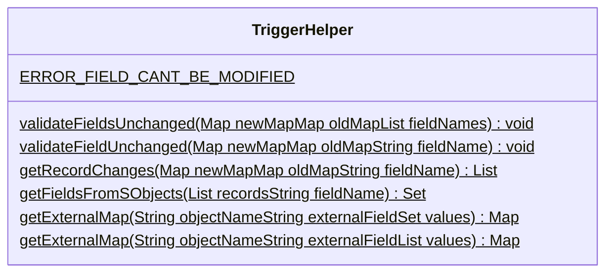

## Introducción

<!-- START autogenerated-class -->
## Descripción

- Status: Active
- Api Version: 59
- Interface 

## Diagrama

### Metodos

*Metodos*
| #   | Nombre | Return | Argumentos |
| --- | ------ | ------ | ---------- |
| 
$
 | validateFieldsUnchanged | void| <ul><li>Map newMap</li><li>Map oldMap</li><li>List fieldNames</li></ul>|
| 
$
 | validateFieldUnchanged | void| <ul><li>Map newMap</li><li>Map oldMap</li><li>String fieldName</li></ul>|
| 
$
 | getRecordChanges | List| <ul><li>Map newMap</li><li>Map oldMap</li><li>String fieldName</li></ul>|
| 
$
 | getFieldsFromSObjects | Set| <ul><li>List records</li><li>String fieldName</li></ul>|
| 
$
 | getExternalMap | Map| <ul><li>String objectName</li><li>String externalField</li><li>Set values</li></ul>|
| 
$
 | getExternalMap | Map| <ul><li>String objectName</li><li>String externalField</li><li>List values</li></ul>|

| #  | Referencia       | #  | Referencia |
| -- | ---------------- | -- | ---------- |
| +  | public or global | #  | protected  |
| -  | private          | ~  | Package    |
| $  | final or static  | *  | abstract   |

<!-- END autogenerated-class -->
