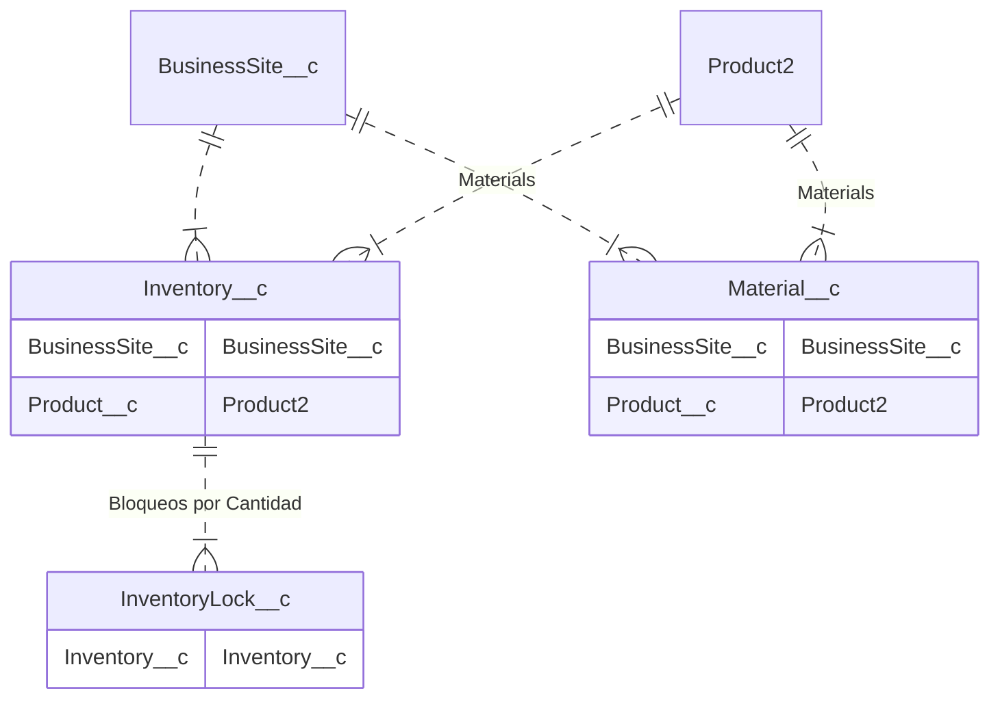

import Drawio from '@theme/Drawio'
import intro from '!!raw-loader!./intro.drawio';

## Intro

Antes de empezar lea el **[Readme](./readme)** del proyecto, donde explica el como bajar el codigo y desarrollar en el proyecto.

## Arquitectura

<Drawio content={intro} page={7} />

<!-- START autogenerated-objects -->

### Transaccionales

| #   | Label | Api Name | Descripcion |
| --- | ----- | -------- | ----------- |
| 

 | [Bloqueo por Cantidad](/diccionarios/objects/InventoryLock__c) | InventoryLock__c ||
| 

 | [Inventario](/diccionarios/objects/Inventory__c) | Inventory__c |Objeto que contiene cantidad total, reservas, muletos y disponibles de cada Punto de Venta / NMU|
| 

 | [Material](/diccionarios/objects/Material__c) | Material__c ||
| 

 | [Product](/diccionarios/objects/Product2) | Product2 ||
| 

 | [Punto de Venta](/diccionarios/objects/BusinessSite__c) | BusinessSite__c ||

### Configuracion

| #   | Label | Api Name | Descripcion |
| --- | ----- | -------- | ----------- |

| #                                                              | Referencia    |
| -------------------------------------------------------------- | ------------- |
| 

 | Track History |

<!-- END autogenerated-objects -->
<!-- START autogenerated-classes -->

### Diagrama

```mermaid
classDiagram


    class BaseTriggerHandler {
     BaseTriggerHandler()  
         run() void 
         setMaxLoopCount(Integer max) void 
         clearMaxLoopCount() void 
         bypass(String handlerName) void $
         clearBypass(String handlerName) void $
         isBypassed(String handlerName) Boolean $
         clearAllBypasses() void $

    }

    link BaseTriggerHandler "./diccionarios/classes/BaseTriggerHandler" 


    class BaseTriggerHandlerException {

    }

    link BaseTriggerHandlerException "./diccionarios/classes/BaseTriggerHandlerException" 


    class InventoryLockTriggerHandler {

    }

    link InventoryLockTriggerHandler "./diccionarios/classes/InventoryLockTriggerHandler" 


    class InventoryTriggerHandler {
         flagInventoryTrigger $    
         beforeInsert() void o
         beforeUpdate() void o
         beforeDelete() void o

    }

    link InventoryTriggerHandler "./diccionarios/classes/InventoryTriggerHandler" 


    class LoopCount {
     LoopCount()  
     LoopCount(Integer max)  
         increment() Boolean 
         exceeded() Boolean 
         getMax() Integer 
         getCount() Integer 
         setMax(Integer max) void 

    }

    link LoopCount "./diccionarios/classes/LoopCount" 


    class MaterialTriggerHandler {
         beforeInsert() void o
         beforeUpdate() void o
         beforeDelete() void o
         afterInsert() void o
         afterUpdate() void o
         afterDelete() void o
         afterUndelete() void o

    }

    link MaterialTriggerHandler "./diccionarios/classes/MaterialTriggerHandler" 


    class MaterialTriggerHelper {
         ESTADO_DISPONIBLE $    
         ESTADO_RESERVADO $    
         ESTADO_VENDIDO $    
         ESTADO_PRESTADO $    
         ESTADO_SINIESTRADO_TELECOM $    
         ESTADO_DISPONIBLE_PRESTAMO $    
         ESTADO_DEVOLUCION_GARANTIA $    
         SIN_ESTADO_PREVIO $    
         agregarInventario(List materiales) void $
         cambiarEstadoInventario(Map materialesOldList materialesNew) void $
         moverDepositoInventario(Map materialesOldList materialesNew) void $
         removerInventario(List materiales) void $
         validateStatusChanges(Map oldMaterialList newMaterial) void $
         completarProducto(List materiales) void $
         completarBusinessSite(List materiales) void $

    }

    link MaterialTriggerHelper "./diccionarios/classes/MaterialTriggerHelper" 


    class TriggerContext {

    }

    link TriggerContext "./diccionarios/classes/TriggerContext" 


    class TriggerHelper {
         validateFieldsUnchanged(Map newMapMap oldMapList fieldNames) void $
         validateFieldUnchanged(Map newMapMap oldMapString fieldName) void $
         getRecordChanges(Map newMapMap oldMapString fieldName) List $
         getFieldsFromSObjects(List recordsString fieldName) Set $
         getExternalMap(String objectNameString externalFieldSet values) Map $
         getExternalMap(String objectNameString externalFieldList values) Map $

    }

    link TriggerHelper "./diccionarios/classes/TriggerHelper" 
 namespace _BaseTriggerHandler {
    class LoopCount 
    class TriggerContext 
    class BaseTriggerHandlerException 
}
```

### Listado

| #   | Name | Api Version | Descripcion |
| --- | ----- | ----------- | ----------- |
| 

 | [BaseTriggerHandler](./diccionarios/classes/BaseTriggerHandler) |59||
| 

 | [BaseTriggerHandlerException](./diccionarios/classes/BaseTriggerHandlerException) |||
| 

 | [InventoryLockTriggerHandler](./diccionarios/classes/InventoryLockTriggerHandler) |61||
| 

 | [InventoryTriggerHandler](./diccionarios/classes/InventoryTriggerHandler) |61||
| 

 | [LoopCount](./diccionarios/classes/LoopCount) |||
| 

 | [MaterialTriggerHandler](./diccionarios/classes/MaterialTriggerHandler) |59||
| 

 | [MaterialTriggerHelper](./diccionarios/classes/MaterialTriggerHelper) |59||
| 

 | [TriggerContext](./diccionarios/classes/TriggerContext) |||
| 

 | [TriggerHelper](./diccionarios/classes/TriggerHelper) |59||

| #  | Referencia       | #  | Referencia |
| -- | ---------------- | -- | ---------- |
| +  | public or global | #  | protected  |
| -  | private          | ~  | Package    |
| $  | final or static  | *  | abstract   |

<!-- END autogenerated-classes -->