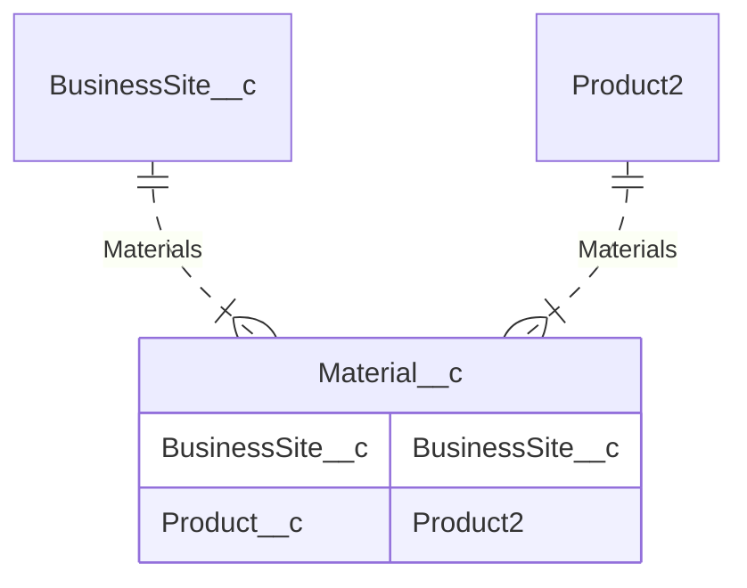

## Tabla de codigos de Movimentos

Sufijos
MT Material propiedad de Telcom
MC Material Propiedad del cliente
MP Material propiedad del proveedor

|Código	|Descripción                                                    |Propiedad          |Tipo depósito|
|-------|---------------------------------------------------------------|-------------------|-------------|
|MCDT	|MCDT - Material de Cliente en Destrucción Total	            |Cliente	        |Viclie       |
|MTPL	|MTPL - TP Disponible para la Venta	                            |TP	                |TP           |
|MCLV	|MCLV - Material de Cliente Vendido u Obsequiado	            |Cliente	        |Viclie       |
|MCVM	|MCVM - Material de Mayorista Vendido u Obsequiado	            |Cliente	        |Mayorista    |
|MCSH	|MCSH - Material de Cliente Siniestrado	                        |Cliente	        |Viclie       |
|MTPC	|MTPC - TP dado en Comodato	                                    |TP	                |Viclie       |
|MTCM	|MTCM - TP dado como Muleto a cliente	                        |TP	                |TP           |
|MTPM	|MTPM - TP Muleto	                                            |TP	                |TP           |
|MTPU	|MTPU - TP en Uso Interno	                                    |TP	                |TP           |
|MTPH	|MTPH - TP Siniestrado	                                        |Cliente	        |Viclie       |
|MCMS	|MCMS – Material cliente mayorista siniestrado	                |Cliente	        |Viclie       |
|MTCO	|MTCO - TP Consignado	                                        |TP	                |Mayorista    |
|MTDG	|MTDG - TP devuelto en garantía	                                |TP	                |TP           |
|MCDG	|MCDG - Cliente devuelto en garantía	                        |Cliente	        |Mayorista    |
|MTCA	|MTCA - Material cliente mayorista facturado en consignación	|Cliente	        |Mayorista    |
|MCBN	|MCBN - Material en banda negativa fraude	                    |Cliente	        |Viclie       |
|MTNC	|MTNC - TP no comercializable (obsoleto)	                    |TP	                |TP           |
|MTPR	|MTPR - TP disponible para la venta reciclado	                |TP	                |TP           |
|MTRE	|MTRE - TP Reservado para Venta	                                |TP	                |TP           |
|MCRE	|MCRE – Material cliente Reservado para Venta	                |Cliente	        |Mayorista    |
|MTER	|MTER – Material en reparación	                                |TP	                |TP           |
|MPER	|MPER – Material de proveedor en reparación	                    |Proveedor	        |Proveedor    |

<!-- START autogenerated-objects -->

### Transaccionales

| #   | Label | Api Name | Descripcion |
| --- | ----- | -------- | ----------- |
| 

 | [Material](/diccionarios/objects/Material__c) | Material__c |Este objeto contiene todos los bienes de cambio y de prestamo que estan en las sucursales. El alta viene por interface desde SAP, y cuando se venden y se concilian en SAP ya se pueden archivar.|

### Configuracion

| #   | Label | Api Name | Descripcion |
| --- | ----- | -------- | ----------- |

| #                                                              | Referencia    |
| -------------------------------------------------------------- | ------------- |
| 

 | Track History |

<!-- END autogenerated-objects -->