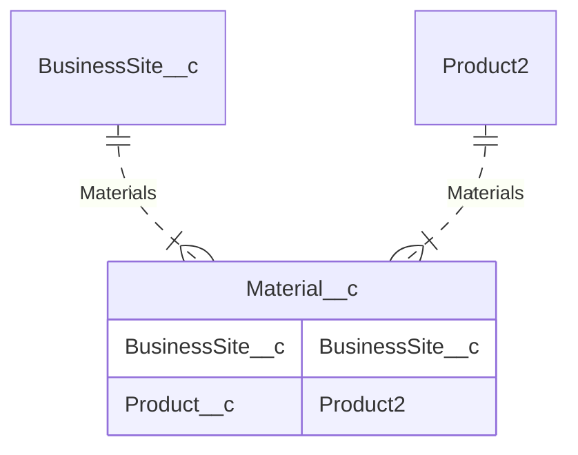

## Introducción

<!-- START autogenerated-objects -->

### Transaccionales

| #   | Label | Api Name | Descripcion |
| --- | ----- | -------- | ----------- |
| 

 | [Business Site](/diccionarios/objects/BusinessSite__c) | BusinessSite__c ||
| 

 | [Material](/diccionarios/objects/Material__c) | Material__c ||

### Configuracion

| #   | Label | Api Name | Descripcion |
| --- | ----- | -------- | ----------- |

| #                                                              | Referencia    |
| -------------------------------------------------------------- | ------------- |
| 

 | Track History |

<!-- END autogenerated-objects -->