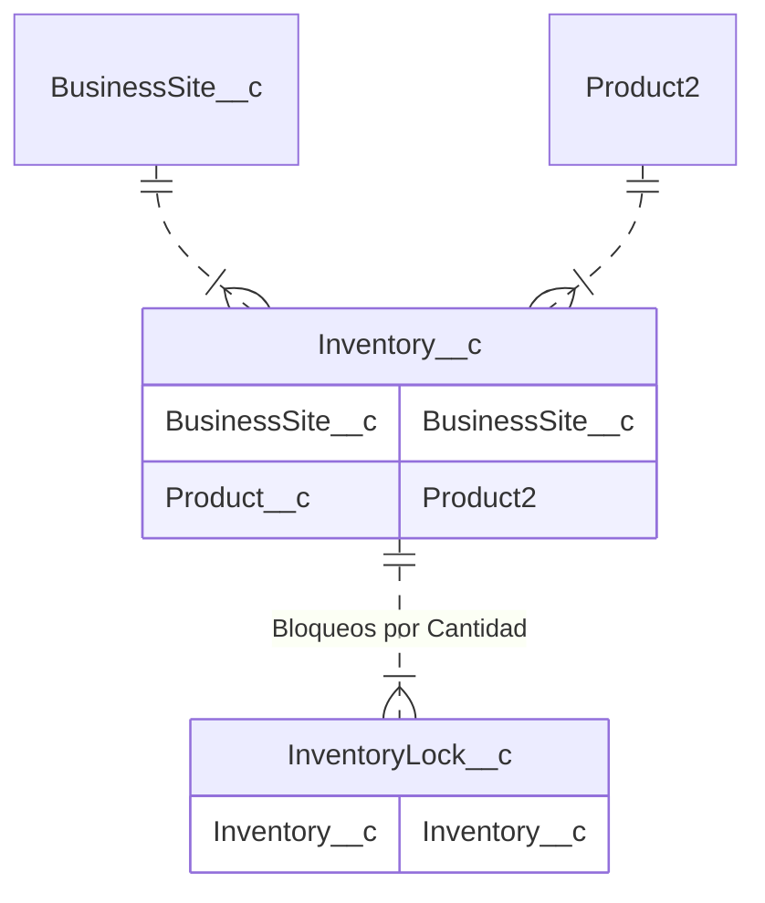

## Descripcion
El servicio consulta la disponibilidad de materiales en un punto de venta. 

* Asincronica

## Consumidores

* [CRM] Proceso de Venta

## Request

| Campo             | Obligatorio  | Descripción | Tipo de Dato | 
| -----             | ------------ | ----------- | ------------ |
| idPuntoDeVenta    |  |  |  |
| codDeposito       |  |  |  |
| codMarca          |  |  |  |
| codFamiliaProducto|  |  |  |

 
## Responses

| Campo | Obligatorio  | Descripción | Tipo de Dato | 
| ----- | ------------ | ----------- | ------------ |

## Errores

## Componentes

## Objetos
<!-- START autogenerated-objects -->

### Transaccionales

| #   | Label | Api Name | Descripcion |
| --- | ----- | -------- | ----------- |
| 

 | [Bloqueo por Cantidad](/diccionarios/objects/InventoryLock__c) | InventoryLock__c ||
| 

 | [Inventario](/diccionarios/objects/Inventory__c) | Inventory__c |Objeto que contiene cantidad total, reservas, muletos y disponibles de cada Punto de Venta / NMU|

### Configuracion

| #   | Label | Api Name | Descripcion |
| --- | ----- | -------- | ----------- |

| #                                                              | Referencia    |
| -------------------------------------------------------------- | ------------- |
| 

 | Track History |

<!-- END autogenerated-objects -->

## Clases
